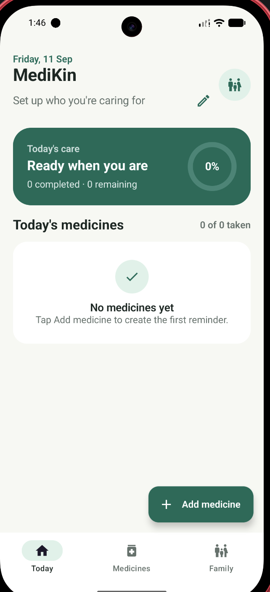

<p align="center">
  
</p>

<h1 align="center">MediKin</h1>

<p align="center">
  A calm, local-first Android medicine tracker for families.<br>
  Built with Kotlin, Jetpack Compose, Material 3, and an MVVM-style architecture.
</p>

<p align="center">
  
</p>

## About

MediKin helps a family organize a parent's daily medicines without accounts, ads, analytics, or cloud storage. Add each medicine with one or more custom times, record whether a dose was taken or skipped, monitor remaining stock, and receive a family check-in alert when a dose is still unrecorded five minutes later.

Fresh installs contain no dummy medicines or preset names. The family profile controls the “Caring for …” subtitle and optional contact used by the dialer and pre-filled message actions.

## Highlights

- Daily timeline with Upcoming, Due, Taken, Skipped, and Missed states
- Multiple reminders per medicine using presets or any custom time
- Audible dose alerts and an automatic five-minute missed-dose follow-up
- Idempotent dose recording and stock deduction
- Refill warnings and one-tap restocking
- Editable parent and caregiver profile
- One-tap dialer and pre-filled SMS handoff without phone or SMS permission
- Alarm restoration after reboot or app update
- Persistent, private on-device storage
- Responsive Material 3 UI with light/dark themes and accessible controls
- Android Back navigation from Medicines or Family to the Today screen

## Reminder design

MediKin uses `AlarmManager` with short-lived `BroadcastReceiver`s for user-selected reminder times. The receiver posts the notification and exits; no always-running service is kept in memory. This is intentionally lighter for low-end devices and more appropriate for time-based alarms than deferrable WorkManager jobs.

The app uses inexact alarms so it does not require Android's special exact-alarm access. Battery Saver, Doze, and manufacturer-specific background restrictions can delay delivery, so MediKin is an organizational aid rather than an emergency or medical-device alarm.

## Architecture

```text
Jetpack Compose UI
        ↓
TrackerViewModel
        ↓
MedicationRepository
        ↓
Preferences + JSON storage

Domain models/reducer/planner ← Alarm scheduler + receivers
```

- `ui`: Compose screens, state hoisting, and `TrackerViewModel`
- `domain`: immutable models, dose planning, adherence, and reducer logic
- `data`: repository contract, JSON serialization, and local persistence
- `reminder`: alarm scheduling, notification channels, boot restoration, and actions

Dependencies are created once in `MedicineTrackerApp`; the project does not need a heavyweight dependency-injection framework.

## Tech stack

- Kotlin 2.0.21
- Jetpack Compose with Material 3
- Android Gradle Plugin 8.13.2 and Gradle 8.13
- Lifecycle ViewModel and StateFlow
- Gson-backed local persistence
- JUnit, Robolectric, Compose UI Test, and Android instrumentation tests
- Minimum Android version: Android 8.0 (API 26)
- Compile/target SDK: 36

## Getting started

Requirements:

- Android Studio with JDK 17
- Android SDK 36

```bash
git clone https://github.com/vhimanshu07/MediKin.git
cd MediKin
./gradlew assembleDebug
```

The debug APK is generated at `app/build/outputs/apk/debug/app-debug.apk`.

## Test and verify

Run unit, Robolectric, lint, APK, instrumentation APK, and release-bundle checks:

```bash
./gradlew testDebugUnitTest lintDebug assembleDebug assembleDebugAndroidTest bundleRelease
```

With an emulator or device connected:

```bash
./gradlew connectedDebugAndroidTest
```

The current build passes 34 local tests, 3 connected-emulator UI tests, and Android lint with zero issues.

## Privacy and permissions

MediKin stores medicine schedules, stock, dose history, and optional family-contact details only in the app's private local storage. Android cloud backup and cleartext traffic are disabled.

Requested permissions:

- `POST_NOTIFICATIONS` on Android 13+ for reminders
- `RECEIVE_BOOT_COMPLETED` to restore reminder schedules after reboot

The app does not request contacts, direct-call, SMS, location, camera, storage, or network permissions. Message and call buttons open the user's chosen external app for review.

## Release resources

- [Play Store listing draft](docs/PLAY_STORE_LISTING.md)
- [Privacy policy](docs/PRIVACY_POLICY.md)
- [Release checklist](docs/RELEASE_CHECKLIST.md)
- [Store artwork](store-assets)

Production bundles must be signed with the distributor's private Play upload key. Signing credentials and keystores must never be committed.

## Medical notice

MediKin is an organizational aid, not a medical device or a substitute for instructions from a qualified healthcare professional. Reminder delivery is not guaranteed to be exact on every device.
